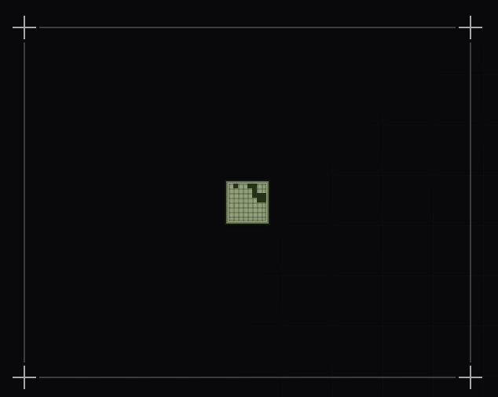

# @scoobynko/snake-loader

A tiny React loader that plays Snake on an 8×8 grid. Meant to sit inline inside buttons, cards, or forms — 24×24px by default. The snake wanders, eats food, grows, and resets when it traps itself. Zero runtime dependencies. ~4kb gzipped. MIT.

**Live demo:** https://jakubsalmik.com/snake-loader



## Install

```bash
npm install @scoobynko/snake-loader
```

## Usage

```tsx
import { SnakeLoader } from "@scoobynko/snake-loader";
import "@scoobynko/snake-loader/styles.css";

<SnakeLoader />                          // 24×24px, nokia theme
<SnakeLoader theme="neon" />             // glow + scanlines
<SnakeLoader cellSize={6} />             // 48×48px
<SnakeLoader
  theme="custom"
  cellSize={4}
  colors={{ snake: "#00ff88", food: "#ff3366", background: "#000" }}
  effects={{ glow: true, pulse: true }}
/>
```

## Props

| Prop        | Type                                                          | Default   | Description                              |
| ----------- | ------------------------------------------------------------- | --------- | ---------------------------------------- |
| `theme`     | `"nokia" \| "neon" \| "minimal" \| "custom"`                  | `"nokia"` | Visual preset.                           |
| `cellSize`  | `number`                                                      | `3`       | Px per cell. Grid is fixed 8×8.          |
| `speed`     | `number`                                                      | `10`      | Cells per second.                        |
| `colors`    | `{ snake?, food?, grid?, background?, glow? }`                | `—`       | Override color tokens.                   |
| `effects`   | `{ glow?: boolean, pulse?: boolean }`                         | `—`       | Toggle visual effects.                   |
| `paused`    | `boolean`                                                     | `false`   | Pause the tick loop.                     |
| `className` | `string`                                                      | `—`       | Pass-through class.                      |
| `style`     | `CSSProperties`                                               | `—`       | Pass-through style.                      |
| `aria-label`| `string`                                                      | `Loading` | A11y label.                              |

All tokens are also exposed as CSS variables (`--snake-loader-snake`, `--snake-loader-glow`, `--snake-loader-trail-ms`, etc.) so you can theme via stylesheet.

## How it plays

- Fixed 8×8 grid.
- Snake starts length 2 and moves 10 cells/sec (configurable).
- Motion is weighted-random: 70% uniform random among safe directions, 30% biased toward food. Simulates a casual human player — wanders, drifts toward food, occasionally traps itself.
- On food contact: snake grows +1.
- On self-collision or wall collision: resets to initial state.
- No progress mode, no score, no game over — runs forever until unmounted or `paused`.

## Accessibility

- `role="progressbar"` with `aria-busy="true"` and an `aria-label` (defaults to "Loading").
- Respects `prefers-reduced-motion` — halves tick speed, disables pulse/trail.

## License

MIT © [Jakub Šalmík](https://jakubsalmik.com)
